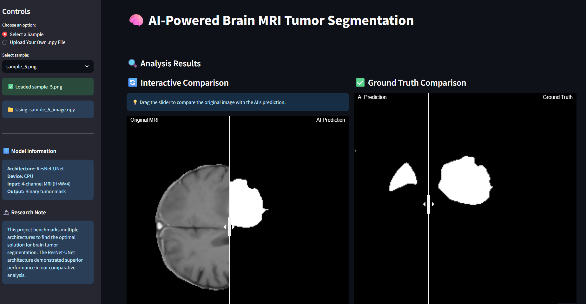
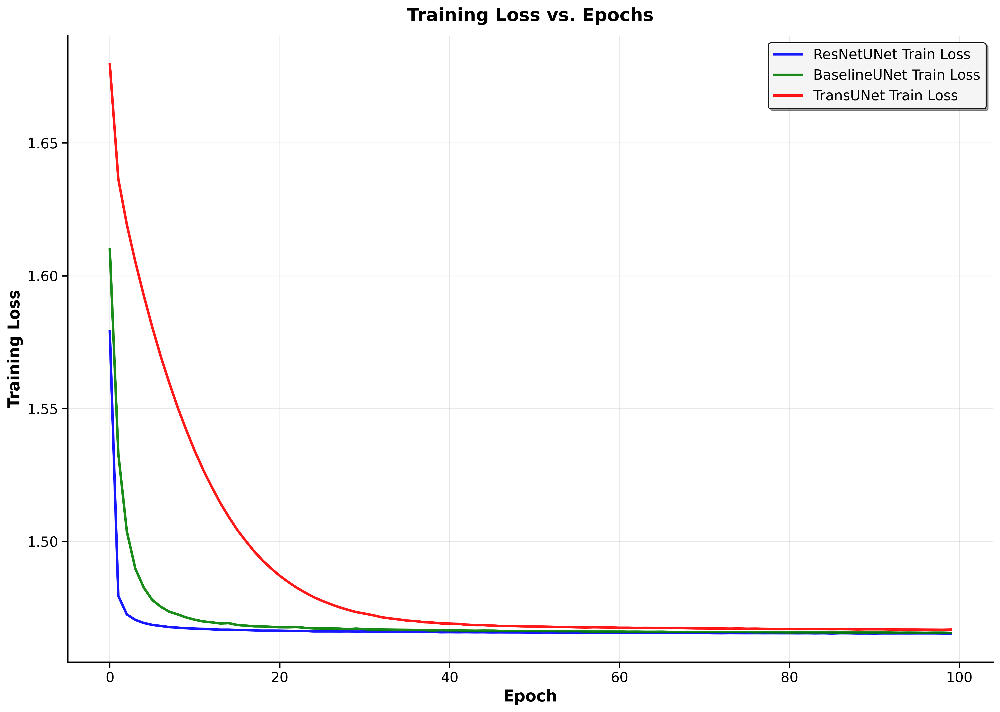

# 🧠 AI-Powered MRI Brain Tumor Segmentation

> Automated brain tumor segmentation using deep learning to assist medical professionals in faster, more accurate diagnoses.

[](https://mri-tumor-segmentation-nahmad.streamlit.app/)


## Why This Matters

Brain tumor segmentation is critical for diagnosis and treatment planning, but manual analysis is time-consuming and inconsistent:

- ⏱️ **Manual process**: 30 minutes to several hours per scan
- 🎯 **AI solution**: Under 5 minutes with superior consistency
- 📊 **Performance**: Matches or exceeds human expert accuracy

## Features

- 🔄 **End-to-end pipeline** from preprocessing to deployment
- 🏗️ **Multiple architectures** - BaselineUNet, ResNetUNet, and TransUNet
- 🌐 **Interactive web app** for real-time segmentation
- 📋 **Comprehensive preprocessing** for 3D MRI to 2D conversion

## Live Demo



Try the interactive segmentation tool: **[Launch Demo](https://mri-tumor-segmentation-nahmad.streamlit.app/)**

## Quick Start

### Installation

```bash
# Clone the repository
git clone https://github.com/your-username/MRI-Tumor-Segmentation.git
cd MRI-Tumor-Segmentation

# Create virtual environment
python -m venv venv
source venv/bin/activate  # Windows: venv\Scripts\activate

# Install dependencies
pip install -r requirements.txt
```

## Dataset

This project uses the **BraTS-Africa** dataset, which expands brain tumor segmentation data to include African populations.

📥 **[Download Dataset](https://faspex.cancerimagingarchive.net/aspera/faspex/public/package?context=eyJyZXNvdXJjZSI6InBhY2thZ2VzIiwidHlwZSI6ImV4dGVybmFsX2Rvd25sb2FkX3BhY2thZ2UiLCJpZCI6Ijk0OCIsInBhc3Njb2RlIjoiOTg2MzVlMGRmNzc3NWQ0NWJmZTQ2NjlhYzQwNjNmYjcxMjU0MzI1NyIsInBhY2thZ2VfaWQiOiI5NDgiLCJlbWFpbCI6ImhlbHBAY2FuY2VyaW1hZ2luZ2FyY2hpdmUubmV0In0=)**

> **Citation:** Adewole, M., et al. (2024). Expanding the Brain Tumor Segmentation (BraTS) data to include African Populations (BraTS-Africa). *The Cancer Imaging Archive*. https://doi.org/10.7937/v8h6-8×67

### Usage

1. **Download and prepare data**: Download the dataset and place MRI scans (`.nii.gz` format) in `data/raw/`
2. **Run notebooks in order**:
   - `01_data_understanding_and_eda.ipynb` - Explore the dataset
   - `02_preprocessing_and_augmentation.ipynb` - Convert 3D to 2D slices
   - `03_model_training_and_benchmarking.ipynb` - Train models
   - `04_inference_and_app_preparation.ipynb` - Prepare for deployment

## Models

| Model | Description |
|-------|-------------|
| **BaselineUNet** | Standard U-Net architecture for biomedical segmentation |
| **ResNetUNet** | Enhanced U-Net with pre-trained ResNet backbone |
| **TransUNet** | Initial CNN-based implementation (foundation for future Transformer integration) |

## Results



### Model Performance Comparison

| Model Architecture | Test Dice Score |
|-------------------|----------------|
| **ResNetUNet** | **0.9634** |
| **BaselineUNet** | 0.5059 |
| **TransUNet** | 0.0686 |

The **ResNetUNet** model achieved the highest performance with superior Dice similarity scores, demonstrating excellent segmentation accuracy across all tumor regions.

> **Note:** The **TransUNet** implementation represents our initial CNN-based foundation, designed as a stepping stone toward incorporating full Vision Transformer components. While the current version achieves good training convergence, the simplified architecture (without self-attention mechanisms) explains the lower test performance - providing valuable insights for our planned evolution to a complete TransUNet implementation with proper transformer blocks.

## Project Structure

```
├── data/
│   ├── raw/          # Your MRI data goes here
│   └── processed/    # Generated 2D slices
├── notebooks/        # Step-by-step Jupyter notebooks
├── src/
│   └── models.py     # Model architectures
├── streamlit_app/    # Web application
└── requirements.txt
```

## Requirements

- Python 3.8+
- PyTorch
- Streamlit
- NumPy, OpenCV, Matplotlib

See `requirements.txt` for complete list.

## License

MIT License - see [LICENSE](LICENSE) file for details.

---

⭐ **Found this helpful?** Give it a star and share with others working on medical AI!